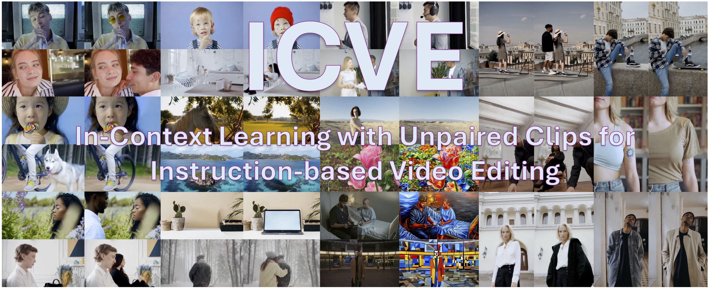

<div align="center">
  <!-- Project Title -->
  <h2>ICVE: In-Context Learning with Unpaired Clips for Instruction-based Video Editing</h2>
  <!-- Project Badges -->
  <p>
    <a href="https://arxiv.org/abs/2510.14648">
      
    </a>
    <a href="https://huggingface.co/leoisufa/ICVE">
      
    </a>
  </p>
</div>

<div align="center">
  <strong>Xinyao Liao<sup>1,2</sup></strong>,
  <strong>Xianfang Zeng<sup>2</sup></strong>,
  <strong>Ziye Song<sup>1</sup></strong>,
  <strong>Zhoujie Fu<sup>1,2</sup></strong>,
  <strong>Gang Yu<sup>2*</sup></strong>,
  <strong>Guosheng Lin<sup>1*</sup></strong>
  <br><br>
  <b>
    <sup>1</sup> Nanyang Technological University
    <a href="#">
      
    </a>
      
    <sup>2</sup> StepFun
    <a href="#">
      
    </a>
  </b>
</div>

<div align="center">
  
</div>

**Star us if you find this project useful! ⭐**

## 🎉 Updates
- [10/2025] 🔥 [Model checkpoints](https://huggingface.co/leoisufa/ICVE) is released!
- [10/2025] 🔥 [Codebase](https://github.com/leoisufa/ICVE) is relased!

## 🧩 Overview

<p align="center">
  
  <br>
  <em>Figure 1. Pipeline of training data curation.</em>
</p>

ICVE proposes a low-cost pretraining strategy for instruction-based video editing via in-context learning from unpaired clips. Built upon [HunyuanVideoT2V](https://github.com/Tencent-Hunyuan/HunyuanVideo), it first learns editing concepts from about **1M** unpaired videos, then fine-tunes on **<150K** paired editing data for improved instruction alignment and visual quality — enabling general editing operations guided by natural language.

<p align="center">
  
  <br>
  <em>Figure 2. In-context Instruction-based Video Editing Model. The instruction, original video, and edited video are injected into the model in an in-context manner. The timesteps corresponding to the original video tokens are fixed to 0, while the timesteps of text and edited video tokens retain T.</em>
</p>

## 🎥 Video Demo
<p align="center">
  <a href="https://youtu.be/ZPXPMJUJnwU">
    
  </a>
</p>

## 🛠️ Dependencies and Installation

Begin by cloning the repository:
```shell
git clone https://github.com/leoisufa/ICVE.git
cd ICVE
```

We recommend CUDA versions 12.4 or 11.8 for the manual installation.

```shell
# 1. Create conda environment
conda create -n icve python==3.10.9

# 2. Activate the environment
conda activate icve

# 3. Install PyTorch and other dependencies using conda
# For CUDA 11.8
conda install pytorch==2.4.0 torchvision==0.19.0 torchaudio==2.4.0 pytorch-cuda=11.8 -c pytorch -c nvidia
# For CUDA 12.4
conda install pytorch==2.4.0 torchvision==0.19.0 torchaudio==2.4.0 pytorch-cuda=12.4 -c pytorch -c nvidia

# 4. Install pip dependencies
python -m pip install -r requirements.txt

# 5. Install flash attention v2 for acceleration (requires CUDA 11.8 or above)
python -m pip install ninja
python -m pip install git+https://github.com/Dao-AILab/flash-attention.git@v2.6.3
```

## 🧱 Download Models
1. **HunyuanVideo Pretrained Weights**  
   Follow the official HunyuanVideo instructions here:  
   👉 [Download Pretrained Models](https://github.com/Tencent-Hunyuan/HunyuanVideo/blob/main/ckpts/README.md)  
   and place the downloaded weights into the `ckpts/` directory as shown above.
2. **ICVE Checkpoint**  
Download the our model weights from  
👉 [Hugging Face](https://huggingface.co/leoisufa/ICVE)  
and place them in the `checkpoint/` directory.

The folder structure of this project should look like this after setup:
```shell
ICVE/
├── assets/
├── checkpoint/ # Our model checkpoint
│   ├── config.json
│   └── diffusion_pytorch_model.safetensors
├── ckpts/  # Pretrained weights from HunyuanVideo
│   ├── hunyuan-video-t2v-720p
│   ├── text_encoder
│   └── text_encoder_2
├── hyvideo/
├── scripts/
├── requirements.txt
├── sample_video.py
└── README.md
``` 

## 🚀 Running the Demos
You can directly run the provided demo scripts under the [`scripts/`](./scripts) directory.
 
Alternatively, you can manually run the example command below:
```bash
python sample_video.py \
    --dit-weight checkpoint/diffusion_pytorch_model.safetensors \
    --video-size 384 240 \
    --video-length 81 \
    --infer-steps 50 \
    --prompt "Add black glasses to the person's face." \
    --video "assets/glasses.mp4" \
    --seed 42 \
    --embedded-cfg-scale 1.0 \
    --cfg-scale 6.0 \
    --flow-shift 7.0 \
    --flow-reverse \
    --use-cpu-offload \
    --save-path ./results
```

## 🙏 Acknowledgements
We thank the following prior art for their excellent open source work: 
- [HunyuanVideo](https://github.com/Tencent-Hunyuan/HunyuanVideo)
- [FastVideo](https://github.com/hao-ai-lab/FastVideo)
- [VACE](https://github.com/ali-vilab/VACE)

## 🔗 BibTeX
If you find [ICEV](https://arxiv.org/abs/2510.14648) useful for your research and applications, please cite using this BibTeX:
```BibTeX
@article{xu2025withanyone,
  title={In-Context Learning with Unpaired Clips for Instruction-based Video Editing}, 
  author={Xinyao Liao and Xianfang Zeng and Ziye Song and Zhoujie Fu and Gang Yu and Guosheng Lin},
  journal={arXiv preprint arxiv:2510.14648},
  year={2025}
}
```